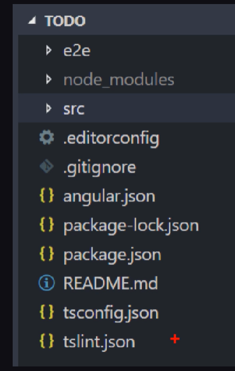

# INTRODUCTION TO ANGULAR

## Topics
 1. Environment setup (Node.js, Angular CLI).
 2. Creating a new Angular project.
 3. Basic Angular project structure (modules, components, templates).
 4. Creating and using components (selectors, templates, styles).
 5. Component lifecycle (ngOnInit, ngOnDestroy, etc.).
 6. Project structure

--------------------

### 1. Environment Setup (Node.js, Angular CLI)

Before you can start developing with Angular, you need to set up your development environment.

- Node.js: Angular applications are built on TypeScript, which is then compiled into JavaScript. Node.js is a JavaScript runtime environment that Angular CLI (Command Line Interface) uses to run its build tools and serve your application during development.

- What to do: Download and install the latest LTS (Long Term Support) version of Node.js from the official Node.js website (nodejs.org).

After installation, open your terminal or command prompt and run node -v and npm -v to ensure Node.js and npm (Node Package Manager, which comes with Node.js) are installed correctly.

- Angular CLI: The Angular CLI is a command-line interface tool that you use to initialize, develop, scaffold, and maintain Angular applications. It automates many development tasks, such as creating new projects, generating components, services, and modules, and running tests.

Once Node.js is installed, you can install the Angular CLI globally using npm. Open your terminal or command prompt and run:

````Bash
npm install -g @angular/cli
````
After installation, run ng version to check the installed Angular CLI version.

### 2. Creating a New Angular Project

Once the Angular CLI is set up, creating a new project is straightforward.

- Command: To create a new Angular project, navigate to the directory where you want to create your project in your terminal and run the ng new command followed by your project name:

````bash
ng new my-first-angular-app
````
- Prompts: The CLI will ask you a few questions:

"Would you like to add Angular routing? (y/N)": For beginners, it's often good to say 'y' to set up basic routing.

"Which stylesheet format would you like to use?": Choose your preferred CSS preprocessor (CSS, SCSS, Sass, Less, Stylus). CSS is fine for beginners.

- What happens: The CLI will create a new directory with your project name, set up the basic Angular project structure, install all necessary npm packages, and configure the project for you. This process can take a few minutes.

- Running the application: Once the project is created, navigate into the project directory (cd my-first-angular-app) and then run the development server:

````bash
ng serve --open
````
This command compiles your application and serves it locally, typically on http://localhost:4200. The --open flag automatically opens your browser to this address.

### 3. Basic Angular Project Structure (Modules, Components, Templates)

Understanding the basic structure is crucial for navigating and developing Angular applications.

- src/folder: This is where your application's source code resides.

- main.ts: The entry point of your application. It bootstraps (starts) the root module (AppModule).

- index.html: The main HTML file of your application. Angular applications are single-page applications, meaning index.html is the only HTML file loaded. All Angular components are rendered within the <app-root> tag in this file.

- app/ folder: Contains the core logic and UI of your application.

- Modules (.module.ts): Angular applications are modular. Modules are containers for a cohesive block of functionality. Every Angular application has at least one root module, conventionally named AppModule (in app.module.ts). Modules declare components, services, pipes, and directives that belong to them and can import other modules.


- @NgModule decorator: Used to define a module. It takes a metadata object that describes the module:

-- declarations: Components, directives, and pipes that belong to this module.

-- imports: Other modules whose exported classes are needed by component templates declared in this module.

-- providers: Services that can be injected into components or other services within this module.

-- bootstrap: The root component that Angular should bootstrap when it starts the application (only in the root AppModule).

- Components (.component.ts, .component.html, .component.css): Components are the fundamental building blocks of Angular applications. They control a part of the screen (a "view"). Each component consists of:

- A TypeScript class: Contains the component's logic (data, methods, lifecycle hooks).

- An HTML template: Defines the component's view.

- CSS styles: Defines the component's specific styles (optional, can be inline or external).

- Templates (.html): HTML with Angular-specific syntax that dictates how the component's data is displayed. They allow for data binding (displaying component data), event binding (responding to user input), and structural directives (manipulating the DOM).

### 4. Creating and Using Components (Selectors, Templates, Styles)

Let's say you want to create a new Header component.

Generating a component: You can use the Angular CLI:

```bash
ng generate component header
# or shorthand
ng g c header
```
This command will create a new folder src/app/header containing four files:

- header.component.ts (component logic)

- header.component.html (component template)

- header.component.css (component styles)

- header.component.spec.ts (testing file)

It also automatically declares the HeaderComponent in your AppModule.

header.component.ts:
````bash
import { Component } from '@angular/core';

@Component({
  selector: 'app-header', // This is how you'll use it in HTML
  templateUrl: './header.component.html', // Path to the template
  styleUrls: ['./header.component.css'] // Path(s) to the styles
})
export class HeaderComponent {
  title = 'My Awesome App'; // Data property
}
````
- selector: A CSS selector that tells Angular where to insert an instance of this component in the HTML. In this case, you'll use <app-header></app-header>.

- templateUrl: Specifies the path to the component's HTML template.

- styleUrls: An array of paths to the component's CSS files. These styles are scoped to the component, meaning they only apply within this component's template.

header.component.html:
````bash
<header>
  <h1>{{ title }}</h1> <nav>
    <ul>
      <li>Home</li>
      <li>About</li>
      <li>Contact</li>
    </ul>
  </nav>
</header>
{{ title }}: This is interpolation, a form of one-way data binding. It displays the value of the title property from the HeaderComponent class in the template.
````

header.component.css:
````bash
header {
  background-color: #333;
  color: white;
  padding: 1em;
  text-align: center;
}
h1 {
  margin: 0;
}
````

- Using the component: To display the HeaderComponent, you simply use its selector in another component's template (e.g., app.component.html):

````bash
<app-header></app-header> <router-outlet></router-outlet>
````

Now, when your application runs, Angular will render the `HeaderComponent` wherever `<app-header>` is placed.

### 5. Component Lifecycle (ngOnInit, ngOnDestroy, etc.)

Angular components have a lifecycle, a series of events managed by Angular itself from creation to destruction. Angular provides lifecycle hooks, which are methods you can implement in your component class to tap into these events.

- Implementing Hooks: To use a lifecycle hook, you need to import the corresponding LifecycleHook interface from @angular/core and implement it in your component class.

Common Lifecycle Hooks:

- ngOnChanges(): Called when Angular sets or resets data-bound input properties. It receives a SimpleChanges object that contains the current and previous property values. This is the first hook to fire when a component's input properties change.

When: Before ngOnInit (if input properties are set) and whenever one or more data-bound input properties change.

- ngOnInit(): Initialized after the component's data-bound properties have been checked for the first time, and before any of its children have been checked. It's often used for:

Fetching data from a remote service.

Performing complex initialization logic.

Setting up subscriptions.

When: Once, after ngOnChanges (if ngOnChanges is triggered).

- ngDoCheck(): Detects and acts upon changes that Angular can't or won't detect on its own. This hook is invoked during every change detection run, immediately after ngOnChanges and ngOnInit.

When: During every change detection cycle. Use with caution as it can impact performance if not used wisely.

- ngAfterContentInit(): Called once after Angular projects external content into the component's view. This hook is useful when you need to access content projected into your component using <ng-content>.

When: Once after ngDoCheck.

- ngAfterContentChecked(): Called after the content (projected into the component) has been checked. This hook is useful when you need to perform additional checks or actions after the projected content has been updated.

When: After ngAfterContentInit and after every subsequent ngDoCheck.

- ngAfterViewInit(): Called once after Angular initializes the component's views and child views. This hook is useful when you need to access elements in the component's own template or its child components' templates using @ViewChild or @ViewChildren.

When: Once after ngAfterContentChecked.

- ngAfterViewChecked(): Called after the component's views and child views have been checked. This hook is useful when you need to perform additional checks or actions after the component's view has been updated.

When: After ngAfterViewInit and after every subsequent ngAfterContentChecked.

- ngOnDestroy(): Called just before Angular destroys the component. This is the place to perform cleanup tasks to avoid memory leaks.

When: Just before the component is removed from the DOM.

What to do:

Unsubscribe from observables.

Clear timers/intervals.

Detach event handlers.

Example using ngOnInit and ngOnDestroy:

````bash
import { Component, OnInit, OnDestroy } from '@angular/core';

@Component({
  selector: 'app-timer',
  template: `<h2>Timer: {{ counter }}</h2>`
})
export class TimerComponent implements OnInit, OnDestroy {
  counter: number = 0;
  intervalId: any;

  ngOnInit(): void {
    console.log('TimerComponent initialized.');
    this.intervalId = setInterval(() => {
      this.counter++;
    }, 1000);
  }

  ngOnDestroy(): void {
    console.log('TimerComponent destroyed.');
    if (this.intervalId) {
      clearInterval(this.intervalId); // Clear the interval to prevent memory leaks
    }
  }
}
````
In this example, the timer starts when the component is initialized (ngOnInit) and stops when the component is destroyed (ngOnDestroy), ensuring resources are properly managed.

### 6. Project structure



Let's talk about the key configuration and manifest files you've highlighted in an Angular project: `tslint.json`, `tsconfig.json`, `package.json`, `package-lock.json`, and `angular.json`. These files play crucial roles in how your Angular application is built, developed, and maintained.

- tslint.json` (or ESLint configuration)

Purpose: This file configures **TSLint**, a static analysis tool that checks TypeScript code for readability, maintainability, and functional errors. It enforces a set of coding style rules and best practices.

Status: **TSLint is deprecated in favor of ESLint.** While older Angular projects might still use `tslint.json`, newer projects (Angular v10 and above) use ESLint for linting TypeScript and JavaScript code. If you create a new Angular project today, you'll likely find ESLint configuration files (e.g., `.eslintrc.json`) instead of `tslint.json`.

What it contains (if present):
    *`defaultSeverity`: The default severity level for rules (e.g., "error" or "warning").
    *`rulesDirectory`: Specifies directories where custom linting rules are located.
    *`rules`: A list of specific linting rules, each with its severity level and optional configurations (e.g., `curly`, `no-console`, `quotemark`).

Why it's important: Helps maintain code consistency, catches potential bugs early, and improves code quality across a development team.

- `tsconfig.json`

Purpose: This file is the **TypeScript compiler configuration file**. It tells the TypeScript compiler (`tsc`) how to compile your TypeScript files into JavaScript.

What it contains:
    *`compilerOptions`: The most important section, defining a wide range of compiler options:
        *`target`: The ECMAScript target version for the compiled JavaScript (e.g., "es2020", "es5").
        *`module`: The module system to use for the generated JavaScript (e.g., "es2020", "commonjs").
        *`lib`: A list of declaration files to be included in the compilation (e.g., "dom", "es2020").
        *`outDir`: The output directory for the compiled JavaScript files.
        *`strict`: Enables a broad range of strict type-checking options, promoting more robust code.
        *`sourceMap`: Generates source map files, which help with debugging compiled JavaScript by mapping it back to the original TypeScript.
        *`baseUrl`: Base directory for resolving non-relative module names.
        *`paths`: Allows you to create alias paths for modules, simplifying imports.
        *`esModuleInterop`: Enables compatibility between CommonJS and ES modules.
        * And many more options related to JSX, decorators, etc.
    *`files` / `include` / `exclude`**: Specify which TypeScript files should be included or excluded from the compilation process.

Why it's important: Essential for defining the TypeScript compilation process, ensuring your code is correctly transformed into runnable JavaScript compatible with your target environment. Angular itself relies heavily on specific TypeScript configurations.

- `package.json`

Purpose: This is the **manifest file for your Node.js project (and thus your Angular project)**. It contains metadata about your project and lists all its dependencies.

What it contains:
    *`name`: The name of your project.
    *`version`: The current version of your project.
    *`scripts`: Defines custom scripts that can be run using `npm run <script-name>` (e.g., `start`, `build`, `test`, `lint`). Angular CLI commands often have corresponding scripts here.
        * `"start": "ng serve"`
        * `"build": "ng build"`
        * `"test": "ng test"`
    *`dependencies`: Lists the third-party packages (and their versions) required for your application to run in production. These are installed when you run `npm install` or `yarn install`. Examples for Angular include `@angular/core`, `@angular/common`, `@angular/router`, `rxjs`, `zone.js`.
    *`devDependencies`: Lists the third-party packages (and their versions) required only for development and testing, not for the production build. Examples for Angular include `@angular/cli`, `@angular-devkit/build-angular`, `typescript`, `karma`, `jasmine-core`.

Why it's important: Manages project dependencies, defines development scripts, and provides essential metadata for your application. It's the central point for sharing and collaborating on your project's dependencies.

- `package-lock.json`

Purpose: This file is **automatically generated by npm (or Yarn, which creates `yarn.lock`)** and records the exact version tree of every dependency that was installed, including their transitive dependencies (dependencies of dependencies).

What it contains: A detailed, hierarchical tree of all installed packages, including their exact versions, checksums, and where they were fetched from.

Why it's important:
    * Reproducibility: Ensures that every developer working on the project, and your CI/CD pipelines, install the exact same versions of all packages. This prevents "it works on my machine" issues caused by subtly different dependency versions.
    * Security: The checksums help verify the integrity of installed packages.
    * You should commit `package-lock.json` to version control.

- 'angular.json`

Purpose: This is the **Angular CLI workspace configuration file**. It defines the structure of your Angular workspace (which can contain multiple Angular projects) and provides global and project-specific configuration for the Angular CLI.

What it contains:
    * `$schema`: Points to the JSON schema for validation.
    * `version`: The version of the `angular.json` schema.
    * `newProjectRoot`: The folder where new projects are created within the workspace.
    * `defaultProject`: The default project for CLI commands if not specified.
    * `cli`: Global CLI configurations (e.g., default collection for schematics).
    * `projects`: This is the core section, defining each project within your workspace. For each project (e.g., `my-first-angular-app`), it includes:
        * `root`: The root directory of the project.
        * `sourceRoot`: The root directory for the project's source code (usually `src`).
        * `prefix`: The prefix for component selectors (e.g., `app-` for `app-root`).
        * `architect`: Defines configuration for various CLI commands (builders) for that project:
            * `build`: Configuration for building the application (output directory, assets, styles, scripts, optimization, source maps, budgets, etc.).
            * `serve`: Configuration for serving the application (port, proxy configuration, ssl, etc.).
            * `test`: Configuration for running unit tests (test framework, browsers).
            * `lint`: Configuration for linting (which linter to use, if TSLint or ESLint).
            * `e2e`: Configuration for end-to-end tests.

Why it's important: It's the central configuration file for the Angular CLI, enabling you to customize how your Angular projects are built, served, tested, and managed. Without it, the Angular CLI wouldn't know how to operate on your project.

In summary, these files are the backbone of an Angular project, providing essential instructions and metadata for everything from code style and compilation to dependency management and CLI operations. Understanding their roles is key to effectively developing and maintaining Angular applications.